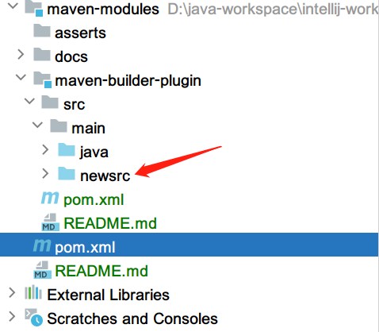
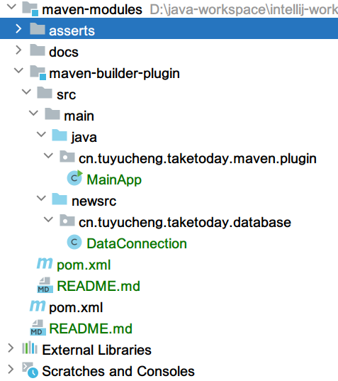
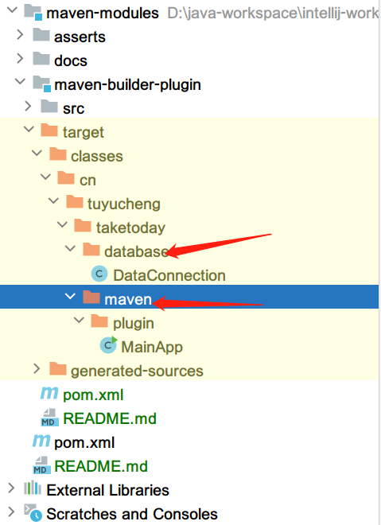

## 1. 概述

本文中,我们将解释如何在基于Maven的Java项目中添加多个源文件目录.

## 2. 额外源目录

假设我们需要在src/main中添加一个/newsrc源目录:



首先,让我们创建一个简单的Java文件DataConnection.java.放置在src/main/newsrc/文件夹中:

```java
public class DataConnection {

  public static String temp() {
    return "secondary source directory";
  }
}
```

之后,让我们在src/main/java目录中创建另一个Java文件,它使用在src/main/newsrc文件夹中创建的DataConnection类:

```java
public class MainApp {

  public static void main(String[] args) {
    System.out.println(DataConnection.temp());
  }
}
```

在我们尝试编译Maven项目之前,让我们快速了解一下该项目的结构:



现在,如果我们试图编译它,我们会得到一个编译错误:

```
[ERROR] BuilderHelper/src/main/java/cn/tuyucheng/taketoday/maven/plugin/MainApp.java:[3,29] package cn.tuyucheng.taketoday.database does not exist
[ERROR] BuilderHelper/src/main/java/cn/tuyucheng/taketoday/database/MainApp.java:[9,28] cannot find symbol
[ERROR] symbol: variable DataConnection
[ERROR] location: class cn.tuyucheng.taketoday.maven.plugin.MainApp
```

我们可以理解错误消息的根本原因-我们在常规项目目录配置之外定义了DataConnection类.

默认情况下,Maven只支持一个源文件夹.要配置多个源目录,我们需要使用名为build-helper-maven-plugin的Maven插件.

## 3. 使用build-helper-maven-plugin添加额外源目录

为了解决上述错误,我们将使用build-helper-maven-plugin添加一个源目录.这个插件帮助我们以最少的配置实现我们的目标.

由于src/main文件夹旁边有一个同级目录,现在我们将添加第二个源目录:

```
<build>
  <plugins>
    <plugin>
      <groupId>org.codehaus.mojo</groupId>
      <artifactId>build-helper-maven-plugin</artifactId>
      <version>3.2.0</version>
      <executions>
        <execution>
          <id>add-source</id>
          <phase>generate-sources</phase>
          <goals>
            <goal>add-source</goal>
          </goals>
          <configuration>
            <sources>
              <source>src/main/newsrc/</source>
            </sources>
          </configuration>
        </execution>
      </executions>
    </plugin>
  </plugins>
</build>
```

在这里,我们在generate-sources阶段运行add-source goal.此外,我们在configuration.sources.source标签中指定了源目录.

如我们所知,Maven的默认生命周期包含编译之前的几个阶段:validate, initialize, generate-sources, process-sources, generate-resources,
process-resources, 和compile.因此在这里,我们将在Maven编译源代码之前添加一个新的源目录.

现在,我们将编译该项目,然后构建成功.之后,当我们检查target文件夹时,我们将看到插件从两个源目录生成classes:



我们可以在maven中央仓库上找到这个插件的最新版本.在我们的案例中,我们只添加了一个源目录,但该插件允许我们添加任意数量的源目录.
