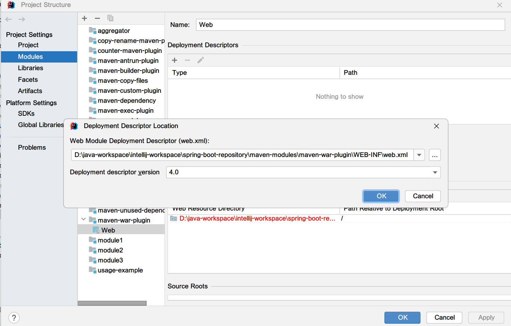

## 1. 概述

在本文中.我们将介绍创建web应用程序时遇到的常见错误,不存在"web.xml",failOnMissingWebXml设置为true.

## 2. 错误描述

在Java web应用程序中,web.xml是部署描述符的标准名称.

我们可以使用Maven创建一个web应用程序,或者使用Intellij-IDEA创建一个JavaWeb项目.IDEA默认会在/WEB-INF目录下创建项目描述符web.xml文件.

**JavaEE6+规范可以不需要web.xml,因为它们可以被注解替代**.然而,较低版本仍然需要它.

failOnMissingWebXml是org.apache.maven.plugins:maven-war-plugin的属性之一.对于低于3.1.0的版本,此插件的默认值为true,对于更高版本,此插件的默认值为false.

这意味着,如果我们使用的是3.1.0版本之前的maven-war-plugin,以及web.xml文件不存在,那么将其打包为war文件的goal将失败.

## 3. 使用web.xml

对于所有我们仍然web.xml部署描述符的情况,我们可以很容易地在IDEA中生成web.xml:

+ 右击File菜单,选择Project Structure,或者快捷键Ctrl+Alt+Shift+S.
+ 在弹出的Project Structure窗口中,选择Project Settings中的Modules,然后选择相应的模块.
+ 右击模块选择Add -> web,在Deployment Descriptors中点击+,选择web.xml,选择相应的web.xml文件存放的路径.



## 4. 不使用web.xml

在大多数情况下,我们可能不需要web.xml文件.在我们的项目中,我们可以简单地跳过创建它.幸运的是,根据我们使用的maven-war-plugin的版本,有两种简单的方法.

### 4.1 maven-war-plugin 3.1.0之前的版本

我们可以在pom.xml的plugins部分配置Maven项目的所有插件.正如我们之前所说,failOnMissingWebXml的默认值在插件版本3.1.0之前为true.

让我们在pom.xml中声明maven-war-plugin,并显式将failOnMissingWebXml属性设置为false:

```
<plugin>
  <artifactId>maven-war-plugin</artifactId>
  <version>2.4</version>
  <configuration>
    <failOnMissingWebXml>false</failOnMissingWebXml>    
  </configuration>
</plugin>
```

### 4.2 maven-war-plugin 3.1.0之后的版本

我们还可以通过升级maven-war-plugin的版本来避免显式设置属性.对于maven-war-plugin 3.1.0及更高版本,failOnMissingWebXml属性的默认值为false:

```
<plugin>
  <artifactId>maven-war-plugin</artifactId>
  <version>3.1.0</version>
</plugin>
```
