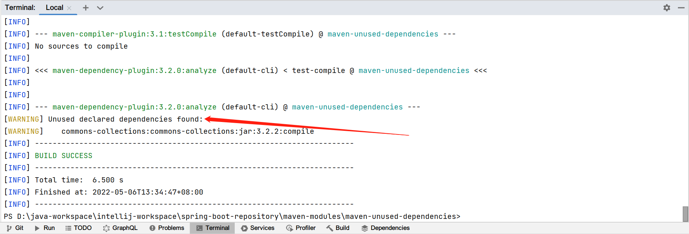

## 1. 概述

当使用Maven管理项目依赖关系时,我们可能会忘记应用程序中使用了哪些依赖.

在本文中,我们将介绍如何使用Maven dependency插件,这个插件可以帮助我们在项目中找到未使用的依赖.

## 2. 项目构建

让我们首先添加几个依赖,slf4j-api(我们将使用的)和commons-collections(我们不使用的):

```
<dependencies>
  <dependency>
    <groupId>commons-collections</groupId>
    <artifactId>commons-collections</artifactId>
    <version>3.2.2</version>
  </dependency>
  <dependency>
    <groupId>org.slf4j</groupId>
    <artifactId>slf4j-api</artifactId>
    <version>1.7.29</version>
  </dependency>
</dependencies>
```

我们可以访问Maven dependency plugin,而无需在pom中指定它.在任何情况下,我们都可以使用pom。xml定义来指定版本以及一些属性(如果需要):

```
<plugin>
  <artifactId>maven-dependency-plugin</artifactId>
  <version>3.1.2</version>
</plugin>
```

## 3. 代码案例

现在我们已经构建好了项目,让我们编写一行代码,使用之前定义的依赖项之一:

```java
public class UnusedDependenciesExample {

  public Logger getLogger() {
    return LoggerFactory.getLogger(UnusedDependenciesExample.class);
  }
}
```

**该方法返回Slf4j中Logger对象.但它没有使用common-collections库,因此可能会被删除**.

## 4. 查找未使用的依赖项

使用Maven dependency plugin,我们可以找到项目中没有使用的依赖.为此,我们调用插件的analyze goal:

```
mvn dependency:analyze
```



对于我们项目中未使用的每个依赖项,Maven都会在分析报告中发出警告.

## 5. 指定依赖被使用

根据项目的性质,有时我们可能需要在运行时加载类,例如在面向插件的项目中.

由于在编译时没有使用依赖项,maven-dependency-plugin会发出警告,指出没有使用依赖项,而事实上确实如此.为此,我们可以强制并指示插件使用库.

我们通过在usedDependencies属性中列出所有依赖项来实现这一点:

```
<plugin>
  <groupId>org.apache.maven.plugins</groupId>
  <artifactId>maven-dependency-plugin</artifactId>
  <configuration>
    <usedDependencies>
      <dependency>commons-collections:commons-collections</dependency>
    </usedDependencies>
  </configuration>
</plugin>
```

再次运行analyze goal,我们看到报告中不再包含未使用的依赖项.
