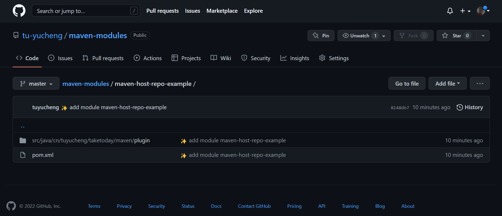

## 1. 概述

在本文中,我们将了解如何在GitHub上托管一个Maven Repository.其中包含使用site-maven插件的源代码.与使用Nexus这样的Repository相比,这是一种价格合理的替代方案.

## 2. 准备工作

我们需要在GitHub为Maven项目创建一个仓库,如果我们还没有的话.在本文中,我们使用一个仓库"maven-host-repo-example"和分支"main".这是GitHub上的一个空库:



## 3. Maven项目

让我们创建一个简单的Maven项目.我们将把这个项目生成的工件推送到GitHub.

这是项目的pom.xml:

```xml
<?xml version="1.0" encoding="UTF-8"?>
<project xmlns:xsi="http://www.w3.org/2001/XMLSchema-instance"
         xmlns="http://maven.apache.org/POM/4.0.0"
         xsi:schemaLocation="http://maven.apache.org/POM/4.0.0 http://maven.apache.org/xsd/maven-4.0.0.xsd">
  <modelVersion>4.0.0</modelVersion>
  <groupId>cn.tuyucheng.taketoday</groupId>
  <artifactId>maven-host-repo-example</artifactId>
  <version>1.0.0</version>

  <build>
    <pluginManagement>
      <plugins>
        <plugin>
          <groupId>org.apache.maven.plugins</groupId>
          <artifactId>maven-compiler-plugin</artifactId>
          <configuration>
            <source>17</source>
            <target>17</target>
          </configuration>
        </plugin>
      </plugins>
    </pluginManagement>
  </build>

  <properties>
    <github.global.server>github</github.global.server>
    <maven.compiler.source>8</maven.compiler.source>
    <maven.compiler.target>8</maven.compiler.target>
  </properties>
</project>
```

首先,我们需要在项目中本地创建内部repository.在推送到GitHub之前,Maven工件将被部署到项目构建目录中的这个位置.

我们将在pom.xml中添加本地repo定义:

```
<distributionManagement>
  <repository>
    <id>internal.repo</id>
    <name>Temporary Staging Repository</name>
    <url>file://${project.build.directory}/mvn-artifact</url>
  </repository>
</distributionManagement>
```

现在,我们将maven-deploy-plugin配置添加到pom.xml.我们将使用此插件将工件添加到目录${project.build.directory}/mvn-artifact中的本地仓库:

```
<plugin>
  <artifactId>maven-deploy-plugin</artifactId>
  <version>2.8.2</version>
  <configuration>
    <altDeploymentRepository>
      internal.repo::default::file://${project.build.directory}/mvn-artifact
    </altDeploymentRepository>
  </configuration>
</plugin>
```

此外,如果我们想将带有Maven工件的源文件推送到GitHub,那么我们还需要包括maven-source-plugin插件:

```
<plugin>
  <groupId>org.apache.maven.plugins</groupId>
  <artifactId>maven-source-plugin</artifactId>
  <version>3.1.0</version>
  <executions>
    <execution>
      <id>attach-sources</id>
      <goals>
        <goal>jar</goal>
      </goals>
    </execution>
  </executions>
</plugin>
```

**一旦将上述配置和插件添加到pom.xml中,构建将在目录target/mvn-artifact中本地部署Maven工件**.

**现在,下一步是将这些工件从本地目录部署到GitHub**.

## 4. 配置GitHub身份验证

在将工件部署到GitHub之前,我们将在MAVEN_HOME/conf/settings.xml中配置身份验证信息.这是为了使site-maven-plugin能够将工件推送到GitHub.

根据我们想要进行身份验证的方式,我们将向settings.xml中添加两种配置.

### 4.1 使用GitHub用户名和密码

要使用GitHub用户名和密码,我们将在settings.xml中配置它们:

```
<settings>
  <servers>
    <server>
      <id>github</id>
      <username>你的用户名</username>
      <password>你的密码</password>
    </server>
  </servers>
</settings>
```

### 4.2 使用Token

使用GitHub API或命令行时,建议使用个人访问令牌(PAT)进行身份验证:

```
<settings>
  <servers> 
    <server>
      <id>github</id>
      <password>你的GitHub Token</password>
    </server>
  </servers>
</settings>
```

## 5. 使用site-maven-plugin插件将工件推送到GitHub

最后一步是配置site-maven-plugin,以推送我们的本地repo.此repo在target目录下:

```
<plugin>
  <groupId>com.github.github</groupId>
  <artifactId>site-maven-plugin</artifactId>
  <version>0.12</version>
  <configuration>
    <message>Maven artifacts for ${project.version}</message>
    <noJekyll>true</noJekyll>
    <outputDirectory>${project.build.directory}</outputDirectory>
    <branch>refs/heads/main</branch>
    <includes>
      <include>**/*</include>
    </includes>
    <merge>true</merge>
    <repositoryName>host-maven-repo-example</repositoryName>
    <repositoryOwner>sgrverma23</repositoryOwner>
    <server>github</server>
  </configuration>
  <executions>
    <execution>
      <goals>
        <goal>site</goal>
      </goals>
      <phase>deploy</phase>
    </execution>
  </executions>
</plugin>
```

作为一个例子,在本教程中,假设我们有一库tu-yucheng/maven-host-repo-example.然后repositoryName标签值将是maven-host-repo-example,repositoryOwner标签值将是tu-yucheng.

现在,我们将执行mvn deploy命令将工件上传到GitHub.如果不存在main分支,将自动创建主分支.成功构建后,在浏览器和main分支下检查GitHub上的仓库.我们所有的二进制文件都将出现在仓库中.
