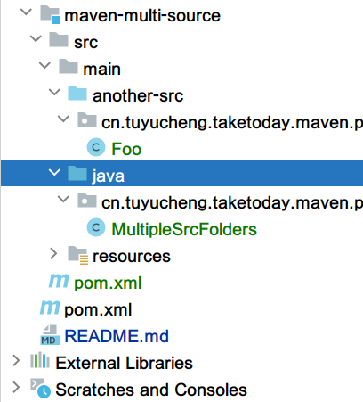

## 1. 概述

我们有时需要在Java项目中使用多个源目录.一个常见的例子是,有自动生成并放置在不同目录中的类.

在这篇短文中,我们将展示如何设置Maven以使用其他源目录.

## 2. 添加另一个源目录

假设我们已经创建了一个Maven项目,让我们在src/main文件夹中添加一个名为another-src的新源目录.

之后,让我们在这个文件夹中创建一个简单的Java类:

```java
public class Foo {
  public static String foo() {
    return "foo";
  }
}
```

现在,让我们在src/main/java目录中创建另一个类,它使用我们刚刚创建的Foo类:

```java
public class MultipleSrcFolders {
  public static void callFoo() {
    Foo.foo();
  }
}
```

我们的项目结构如下所示:



如果我们试图用Maven编译这个项目,我们会得到一个编译错误,因为项目中不包括Foo类:

```
[ERROR] .../MultipleSrcFolders.java:[6,9] cannot find symbol
[ERROR]   symbol:   variable Foo
[ERROR]   location: class cn.tuyucheng.taketoday.maven.plugins.MultipleSrcFolders
```

## 3. 使用Builder Helper插件

有了Maven,我们可以使用Builder Helper插件添加更多源目录.这个插件允许我们以不同的方式自定义构建生命周期.

**它的goal之一是add-sources,目的是在generate-sources阶段向项目中添加更多src目录**.

我们可以通过将其添加到pom中来在项目中使用它:

```
<plugin>
  <groupId>org.codehaus.mojo</groupId>
  <artifactId>build-helper-maven-plugin</artifactId>
  <version>3.0.0</version>
  <executions>
    <execution>
      <phase>generate-sources</phase>
      <goals>
        <goal>add-source</goal>
      </goals>
      <configuration>
        <sources>
          <source>src/main/another-src</source>
        </sources>
      </configuration>
    </execution>
  </executions>
</plugin>
```

如果我们现在编译我们的项目,构建就会成功.
