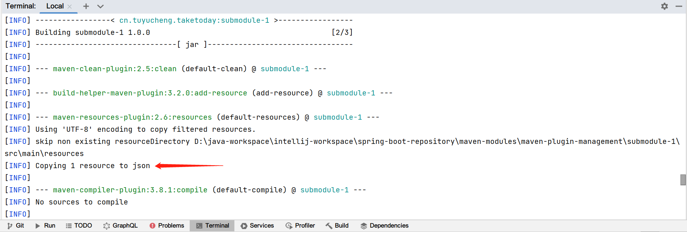

## 1. 概述

Maven是一个强大的工具,它使用插件自动化并执行Java项目中的所有构建和报告任务.

然而,在构建中可能会使用其中的几个插件,以及不同的版本和配置,尤其是在多模块项目中.这可能会导致复杂的pom文件出现问题,其中包含冗余或重复的插件声明,以及分散在各个子项目中的配置.

在本文中,我们将看到如何使用Maven的插件管理机制来处理这些问题,并在整个项目中有效地维护插件.

## 2. 插件配置

Maven有两种类型的插件:

+ Build : 在build过程中执行.例如包括Clean, Install,和Surefire插件.这些应该在pom的build标签进行配置.
+ Reporting : 在site生成期间执行,以生成各种项目报告.例如包括Javadoc和Checkstyle插件.这些在项目pom的reporting标签进行配置.

Maven插件提供了执行和管理项目构建所需的所有有用功能.

例如,我们可以在pom中声明jar插件:

```
<build>
  ....
  <plugins>
    <plugin>
      <groupId>org.apache.maven.plugins</groupId>
      <artifactId>maven-jar-plugin</artifactId>
      <version>3.2.0</version>
      ....
    </plugin>
    ....
  </plugins>
</build>
```

在这里,我们在build标签中声明了插件,以添加将项目编译成jar的功能.

## 3. 插件管理

除了plugins标签,我们还可以在pom的pluginManagement标签中声明插件.它包含插件的方式与我们之前看到的大致相同.但是,通过在pluginManagement标签添加插件,它将可用于此pom以及所有继承的子pom.

这意味着任何子pom都将通过在其plugin标签中引用插件来继承插件执行.我们需要做的就是添加相关的groupId和artifactId,而不必指定配置或管理版本.

与依赖关系管理机制类似,这在多模块项目中特别有用,因为它提供了一个中心位置来管理插件版本和任何相关配置.

## 4. 案例

让我们先创建一个包含两个子模块的简单多模块项目.我们将在父pom中包含Build Helper插件,它包含几个goal来帮助构建生命周期.在我们的例子中,我们将使用它将一些额外的资源复制到子项目的项目输出文件夹中.

### 4.1 父pom配置

首先,我们将插件添加到父pom的pluginManagement部分:

```
<build>
  <pluginManagement>
    <plugins>
      <plugin>
        <groupId>org.codehaus.mojo</groupId>
        <artifactId>build-helper-maven-plugin</artifactId>
        <version>3.2.0</version>
        <executions>
          <execution>
            <id>add-resource</id>
            <phase>generate-resources</phase>
            <goals>
              <goal>add-resource</goal>
            </goals>
            <configuration>
              <resources>
                <resource>
                  <directory>src/resources</directory>
                  <targetPath>json</targetPath>
                </resource>
              </resources>
            </configuration>
          </execution>
        </executions>
      </plugin>
    </plugins>
  </pluginManagement>
</build>
```

这将插件的add-resource goal绑定到默认pom生命周期中的generate-resources阶段.我们还指定了包含额外资源的src/resources目录.插件执行将根据需要将这些资源复制到项目输出目录中的目标位置.

接下来,让我们运行maven命令以确保配置有效且构建成功:

```
mvn clean test
```

运行此操作后,目标位置尚未包含预期的资源.

### 4.2 子POM配置

现在,让我们从子pom中引用这个插件:

```
<build>
  <plugins>
    <plugin>
      <groupId>org.codehaus.mojo</groupId>
      <artifactId>build-helper-maven-plugin</artifactId>
    </plugin>
  </plugins>
</build>
```

与依赖关系管理类似,我们不声明版本或任何插件配置.相反,子项目从父pom中的声明继承这些值.

最后,让我们再次运行build并查看输出:



在这里,插件在构建期间执行,但仅在具有相应声明的子项目中执行.因此,正如预期的那样,项目输出目录现在包含来自指定项目位置的额外资源.

我们应该注意,只有父pom包含插件声明和配置,而子项目只是根据需要引用它.

继承的子项目可以根据需要修改配置.

## 5. 核心插件

默认情况下,有一些Maven核心插件被用作构建生命周期的一部分.例如,clean和compiler插件不需要显式声明.

但是,我们可以在pom的pluginManagement标签中显式声明和配置这些.主要区别在于,核心插件配置自动生效,子项目中不会引用.

让我们通过将maven-compiler-plugin添加到pluginManagement中验证这一点:

```
<plugin>
  <groupId>org.apache.maven.plugins</groupId>
  <artifactId>maven-compiler-plugin</artifactId>
  <version>${maven.compiler.plugin}</version>
  <configuration>
    <source>17</source>
    <target>17</target>
  </configuration>
</plugin>
```

在这里,我们指定了插件版本,并将其配置为使用Java17构建项目.然而,在任何子项目中都不需要额外的插件声明.默认情况下,构建框架会激活此配置.因此,这种配置意味着构建必须使用Java17跨所有模块编译这个项目.

总的来说,明确声明多模块项目中所需的任何插件的配置并锁定其版本是一种很好的做法.因此,不同的子项目只能从父pom继承所需的插件配置,并根据需要应用它们.

这消除了重复声明,简化了pom文件,并提高了构建的可再现性.
