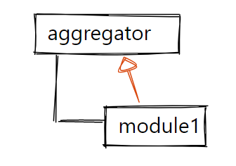
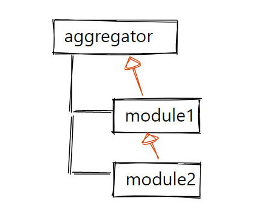
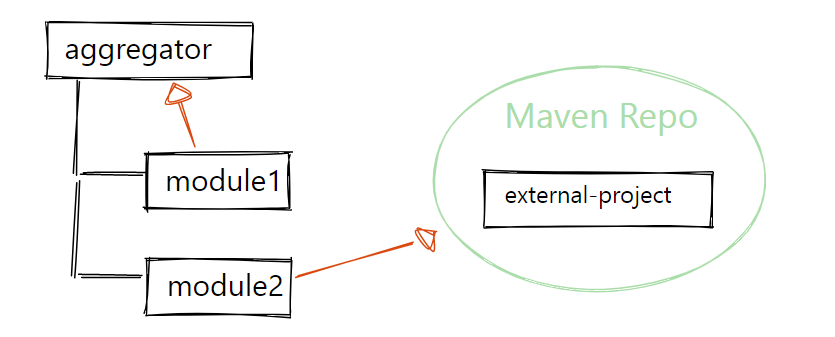

## 1. 概述

在本文中,我们将了解Maven的父pom解析.首先,我们将探讨默认行为.然后,我们将讨论自定义它的可能性.

## 2. 默认父POM解析

如果我们想指定一个父pom,我们可以通过命名groupId,artifactId和version,即所谓的GAV坐标来实现.**Maven不会首先通过搜索repository来解析父pom**
.我们可以在Maven模型文档中找到详细信息,并总结其行为:

1. 如果父文件夹中有pom.xml文件,以及如果该文件具有匹配的GAV坐标,则将其归类为项目的父pom.
2. 如果没有,Maven将从repository搜索.

在管理多模块项目时,将一个Maven模块放入另一个项目是最佳实践.例如,我们有一个aggregator项目,其GAV坐标如下:

```
<groupId>cn.tuyucheng.taketoday</groupId>
<artifactId>aggregator</artifactId>
<version>1.0.0</version>
```

然后,假设我们有一个module1,可以放在该aggregator项目下.



因此,module1的pom可以包括以下部分:

```
<artifactId>module1</artifactId>
<parent>
  <groupId>cn.tuyucheng.taketoday</groupId>
  <artifactId>aggregator</artifactId>
  <version>1.0.0</version>
</parent>
```

无需将aggregator pom安装到repository中.甚至不需要在aggregator pom中声明module1.但我们必须意识到,这只适用于项目的本地签出(例如,在构建项目时).如果项目被解析为来自Maven
repository的依赖,那么父pom也应该在repository中可用.

我们必须确保aggregator pom具有匹配的GAV坐标.否则,我们将得到一个build错误:

```
[ERROR]  Non-resolvable parent POM for cn.tuyucheng.taketoday:module1:1.0.0:
  Could not find artifact cn.tuyucheng.taketoday:aggregator:pom:1.0.0
  and 'parent.relativePath' points at wrong local POM @ line 7, column 13
```

## 3. 自定义父POM的位置

如果父pom不在父文件夹中,我们需要使用relativePath标签来引用该位置.例如,如果第二个模块应该从module1继承,而不是从aggregator继承设置,则必须命名同级文件夹:



```
<artifactId>module2</artifactId>
<parent>
  <groupId>cn.tuyucheng.taketoday</groupId>
  <artifactId>module1</artifactId>
  <version>1.0.0</version>
  <relativePath>../module1/pom.xml</relativePath>
</parent>
```

当然,我们应该只使用每个环境中可用的相对路径(主要是同一Git库中的路径),以确保构建的可移植性.

## 4. 禁用本地文件解析

要跳过本地文件搜索并直接在Maven repository中搜索父pom,我们需要显式地将relativePath设置为空值:

```
<parent>
  <groupId>cn.tuyucheng.taketoday</groupId>
  <artifactId>external-project</artifactId>
  <version>1.0.0</version>
  <relativePath/>
</parent>
```



我们使用的Spring Boot项目就是从外部项目继承,这应该是一种最佳实践.

## 5. IDE

有趣的是,IntelliJ IDEA(当前版本:2022.1)附带了一个Maven插件,与外部Maven运行时在父pom解析方面有所不同.与Maven的pom模式不同,它用以下方式解析relativePath标签:

> Maven首先在当前构建项目的reactor中寻找父pom

这意味着,对于IDE内部解析,只要父项目注册为IntelliJ IDEA的Maven项目,父pom的位置就无关紧要.这可能有助于只开发项目而不显式地构建它们(如果它们不在同一Git仓库的范围内)
.但是,如果我们尝试使用外部Maven运行时构建项目,它将失败.

## 6. 总结

在本文中,我们了解到Maven不会首先通过搜索Maven
repository来解析父pom.而是在本地搜索,当从外部项目继承时,我们必须明确地停用这种行为.此外,IDE还可能解析workspace中的项目,这可能会导致在使用外部Maven运行时出错.
