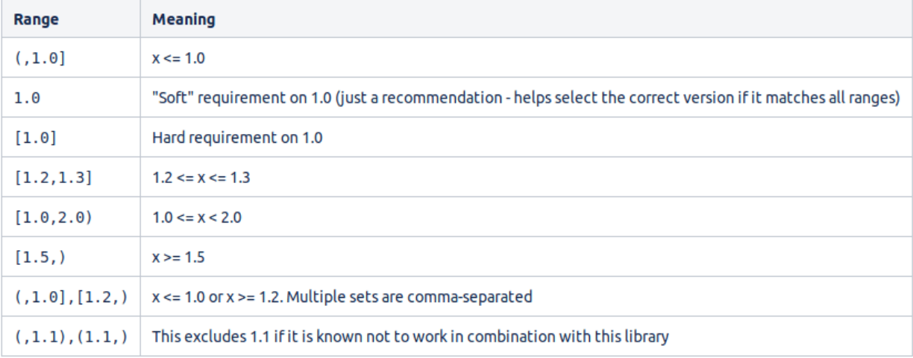
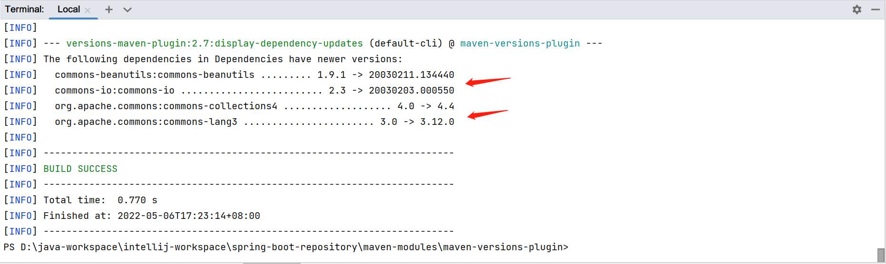
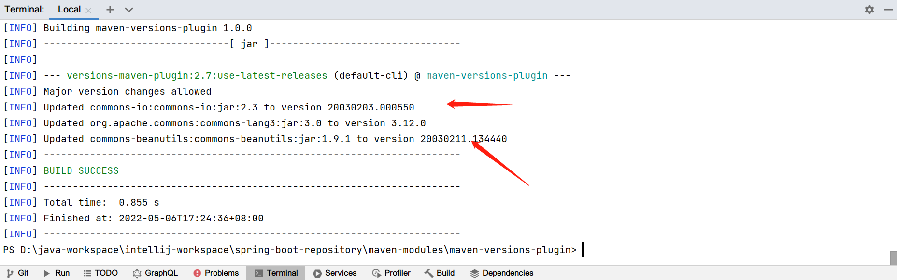

## 1. 概述

手动升级Maven依赖项一直是一项不必要的工作,尤其是在很多库频繁发布的项目中.

在本文中,我们将学习如何利用version-maven-plugin使依赖项保持最新.

最重要的是,在实现自动升级依赖项的持续集成管道,测试所有内容是否仍然正常工作以及提交或回滚结果(以适当的为准)时,这可能非常有用.

## 2. Maven版本范围语法

早在Maven2的时候,开发人员就可以指定版本范围,在该范围内,依赖可以在不需要手动干预的情况下进行升级.

这种语法仍然有效,在一些项目中使用,因此值得了解:



尽管如此,在可能的情况下,我们还是应该避免使用version maven plugin,因为从外部升级具体版本肯定比让Maven自己处理整个操作更好.

### 2.1 不推荐的语法

Maven2还提供了两个特殊的元版本值来实现这个结果:LATEST和RELEASE.

LATEST寻找可能的最新版本,而RELEASE针对的是最新的非快照版本.

事实上,它们对于常规依赖解析仍然绝对有效.

然而,这种传统升级方法在CI需要再现性的地方造成了不可预测性.因此,对于插件依赖解析,它们已被弃用.

## 3. Versions Maven Plugin

Versions Maven Plugin是当今处理版本管理的事实上的标准方式.

从远程仓库之间的高级比较到快照版本的低级时间戳锁定,其庞大的目标列表使我们能够处理涉及依赖关系的项目的各个方面.

虽然其中很多都不在本文的范围内,但让我们更仔细地看一下在升级过程中对我们有帮助的功能.

### 3.1 测试用例

在开始之前,让我们定义一下我们的测试用例:

+ 三个RELEASEs的硬编码版本
+ 一个RELEASE使用属性定义的版本
+ 一个SNAPSHOT

```
<dependencies>
  <dependency>
    <groupId>commons-io</groupId>
    <artifactId>commons-io</artifactId>
    <version>2.3</version>
  </dependency>
  <dependency>
    <groupId>org.apache.commons</groupId>
    <artifactId>commons-collections4</artifactId>
    <version>4.0</version>
  </dependency>
  <dependency>
    <groupId>org.apache.commons</groupId>
    <artifactId>commons-lang3</artifactId>
    <version>3.0</version>
  </dependency>
  <dependency>
    <groupId>org.apache.commons</groupId>
    <artifactId>commons-compress</artifactId>
    <version>${commons-compress-version}</version>
  </dependency>
  <dependency>
    <groupId>commons-beanutils</groupId>
    <artifactId>commons-beanutils</artifactId>
    <version>1.9.1-SNAPSHOT</version>
  </dependency>
</dependencies>

<properties>        
  <commons-compress-version>1.15</commons-compress-version>
</properties>
```

最后,在定义插件时,让我们也从处理过程中排除一个依赖:

```
<build>
  <plugins>
    <plugin>
      <groupId>org.codehaus.mojo</groupId>
      <artifactId>versions-maven-plugin</artifactId>
      <version>${versions.plugin.version}</version>
      <configuration>
        <excludes>
          <exclude>org.apache.commons:commons-collections4</exclude>
        </excludes>
      </configuration>
    </plugin>
  </plugins>
</build>
```

## 4. 显示可用的更新

首先,为了简单地了解是否以及如何更新我们的项目,我们可以使用versions:display-dependency-updates:

```
mvn versions:display-dependency-updates
```



正如我们所看到的,这个过程包括了每个RELEASE版本.它甚至包括commons-collections4,因为配置中的排除是指update过程,而不是discovery.

相比之下,它忽略了SNAPSHOT,因为它是一个开发版本,自动更新通常不安全.

## 5. 更新依赖

当第一次运行更新时,插件会创建pom.xml的一个名为pom.xml.versionsBackup的备份.

而每次迭代都会改变pom.xml,备份文件将保留项目的原始状态,直到用户提交(通过mvn versions:commit)或恢复(通过mvn versions:revert)整个过程为止.

### 5.1 将SNAPSHOT转换为RELEASE版

有时,一个项目包含一个快照依赖(一个仍在开发中的版本).

我们可以使用versions:use-releases来检查相应的版本是否已发布,甚至可以同时转化多个SNAPSHOT到RELEASE版本.

```
mvn versions:use-releases
```

### 5.2 更新到下一个RELEASE

我们可以使用versions:use-next-releases:将每个非快照版本依赖更新到最近的版本:

```
mvn versions:use-next-releases
```



## 6. 过滤掉不需要的版本

如果我们想忽略某些版本,可以调整插件配置,从外部文件动态加载规则:

```
<plugin>
  <groupId>org.codehaus.mojo</groupId>
  <artifactId>versions-maven-plugin</artifactId>
  <version>2.7</version>
  <configuration>
    <rulesUri>http://www.mycompany.com/maven-version-rules.xml</rulesUri>
  </configuration>
</plugin>
```

最值得注意的是,rulesUri还可以引用本地文件:

```
<rulesUri>file:///home/andrea/maven-version-rules.xml</rulesUri>
```

### 6.1 全局忽略版本

我们可以配置rules文件,使其忽略与特定正则表达式匹配的版本:

```
<ruleset comparisonMethod="maven"
  xmlns="http://mojo.codehaus.org/versions-maven-plugin/rule/2.0.0"
  xmlns:xsi="http://www.w3.org/2001/XMLSchema-instance"
  xsi:schemaLocation="http://mojo.codehaus.org/versions-maven-plugin/rule/2.0.0 
  http://mojo.codehaus.org/versions-maven-plugin/xsd/rule-2.0.0.xsd">
    <ignoreVersions>
      <ignoreVersion type="regex">.*-beta</ignoreVersion>
    </ignoreVersions>
</ruleset>
```

### 6.2 忽略每个Rule的版本

最后,如果我们的需求更具体,我们可以建立一套规则:

```
<ruleset comparisonMethod="maven"
  xmlns="http://mojo.codehaus.org/versions-maven-plugin/rule/2.0.0"
  xmlns:xsi="http://www.w3.org/2001/XMLSchema-instance"
  xsi:schemaLocation="http://mojo.codehaus.org/versions-maven-plugin/rule/2.0.0 
    http://mojo.codehaus.org/versions-maven-plugin/xsd/rule-2.0.0.xsd">
    <rules>
      <rule groupId="com.mycompany.maven" comparisonMethod="maven">
        <ignoreVersions>
          <ignoreVersion type="regex">.*-RELEASE</ignoreVersion>
          <ignoreVersion>2.1.0</ignoreVersion>
        </ignoreVersions>
      </rule>
    </rules>
</ruleset>
```

## 7. 总结

我们已经了解了如何以安全,自动且符合Maven3的方式检查和更新项目的依赖关系.

要查看它的运行情况,只需下载项目并在终端中运行(如果使用Windows,可以在Git Bash中运行):

```
./run-the-demo.sh
```
